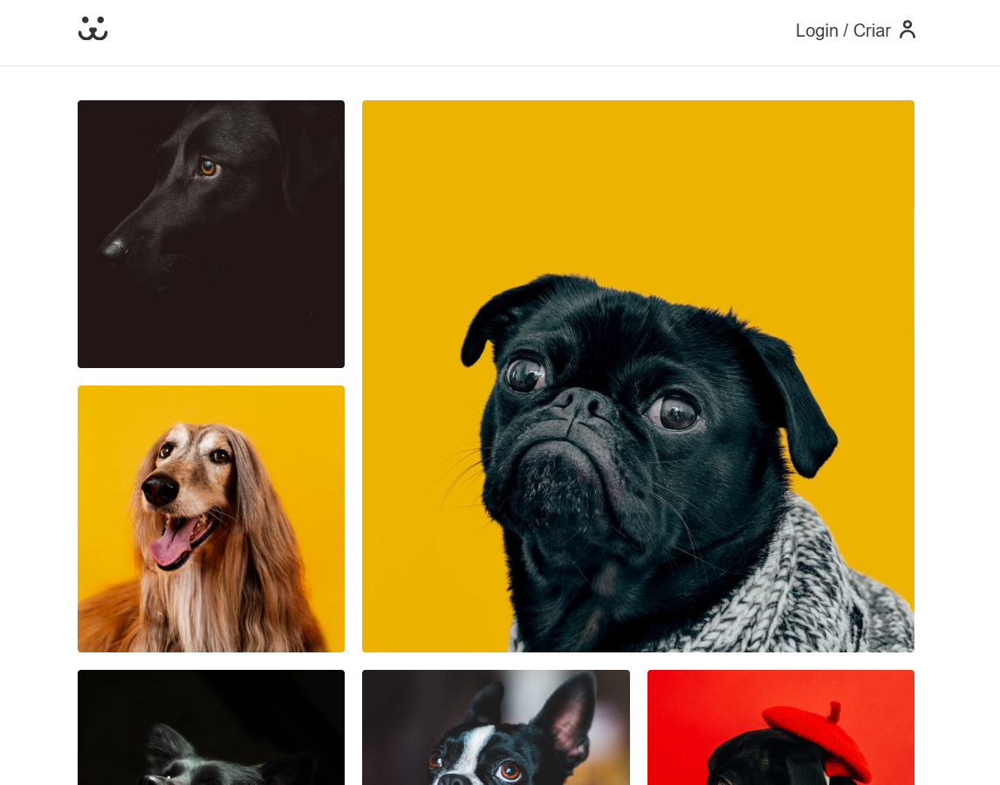
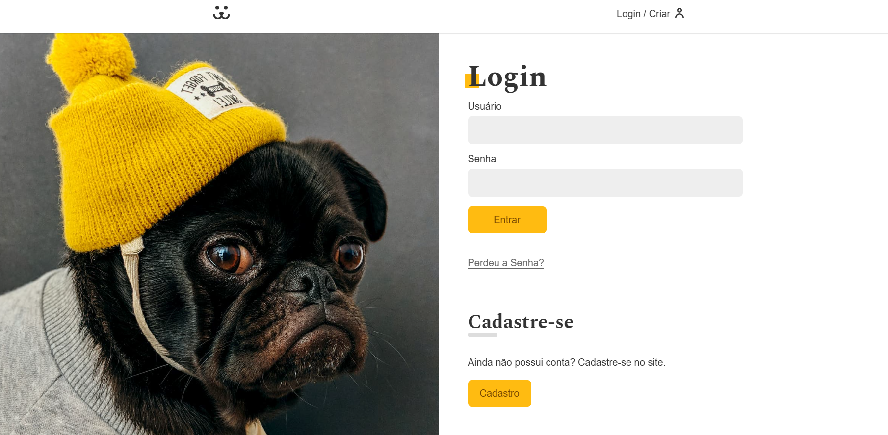

<h1 align="center" style="font-weight: bold;">Dogs - Rede Social Para Cachorros</h1>

<p align="center">
  <a href="#tech">Tecnologias</a> • 
  <a href="#started">Primeiros Passos</a>
</p>

<p align="justify">
  A Rede Social para Cachorros é uma plataforma onde usuários podem criar perfis para seus cães, compartilhar fotos e interagir com outros amantes de animais. O sistema permite visualizar perfis, comentar em publicações, acompanhar fotos de outros cachorros e acessar estatísticas de engajamento, como visualizações e comentários. O objetivo é criar uma comunidade divertida e interativa para compartilhar momentos especiais dos pets.
</p>

<p align="center">
  <a href="https://dogs-web-photos.vercel.app/">📱 Visite o Projeto</a>
</p>

<h2 id="layout">🎨 Layout</h2>

<p align="center">
  
  
</p>

<h2 id="tech">💻 Tecnologias</h2>

- React.js para construção da interface da aplicação.
- Vite como ferramenta de desenvolvimento e build, proporcionando maior desempenho e rapidez.
- React Router DOM para gerenciamento das rotas e navegação entre páginas.
- Victory para criação e visualização de gráficos e estatísticas de acesso.
- Vite Plugin SVGR para importação e utilização de arquivos SVG como componentes React.
- ESLint e Prettier para padronização, qualidade e boas práticas de código.

<h2 id="started">🚀 Primeiros Passos</h2>

Siga os passos abaixo para executar o projeto localmente em seu ambiente de desenvolvimento.

<h3>Pré-requisitos</h3>

Antes de começar, certifique-se de ter instalado:

- <a href="https://nodejs.org/" target="_blank">Node.js</a> (versão 20 ou superior)
- <a href="https://git-scm.com/" target="_blank">Git</a>

<h3>Clonando o Repositório</h3>

Clone o projeto para sua máquina utilizando o comando:

```bash 
git clone https://github.com/Diogo-SoaresDS/dogs.git
```

Acesse a pasta do projeto:

```bash
cd dogs
```

<h3>Instalação das Dependências</h3>

Instale todas as dependências do projeto:

```bash
npm install
```

Após iniciar, o terminal exibirá uma URL semelhante a:
```
http://localhost:5173
```

Abra essa URL em seu navegador para visualizar a aplicação.